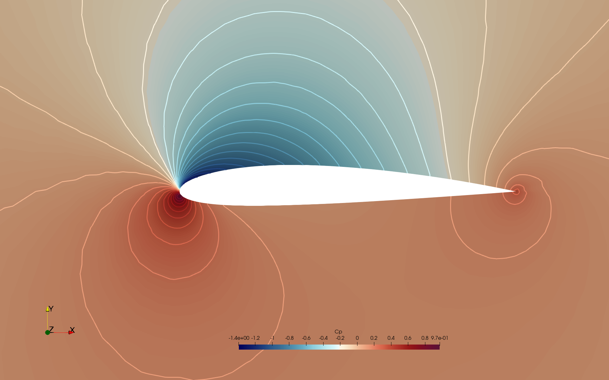
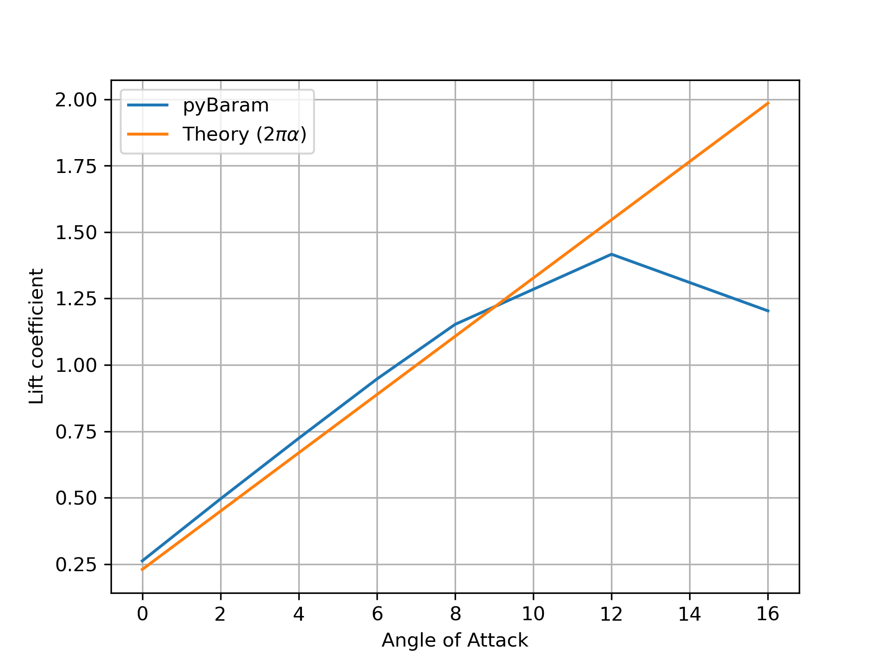

NACA2412 익형 주위 아음속 비점성 유동 해석
============================================
NACA2412 익형에 대해 아음속 비점성 유동 해석.

1. 격자 생성 : gmsh를 이용해서 비점성 격자를 생성
    - 이미 생성되어 있음
    
    - 격자 확인 또는 변형은 gmsh를 이용해서 가능
    
          user@Computer:~/$ gmsh mesh/naca0012.geo

2. pyBaram 양식으로 격자 변경

       user@Computer:~/$ pybaram import mesh/naca0012.msh naca0012.pbrm

3. 계산 실행

       user@Computer:~/$ pybaram run naca0012.pbrm naca0012.ini

    - 받음각 Sweep을 하고 싶을 떄는 저장된 스크립트 활용
  
          user@Computer:~/$ sh scripts/sweep.sh

4. VTK 형식으로 유동 해석 결과 변경

       user@Computer:~/$ pybaram export naca0012.pbrm out-10000.pbrs aoa4.vtu

5. Paraview를 이용한 유동 가시화
   - 저장된 Contour state로 가시화

         user@Computer:~/$ paraview --state=results/contours.pvsm

        

   - 공력 계수 비교
        

